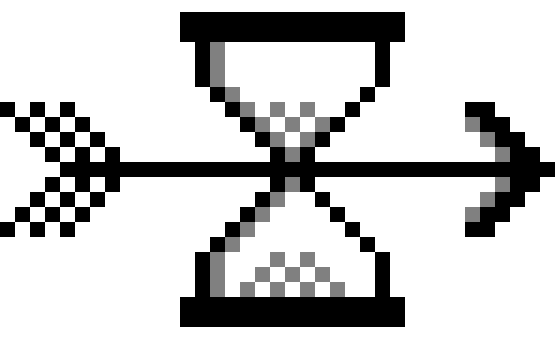
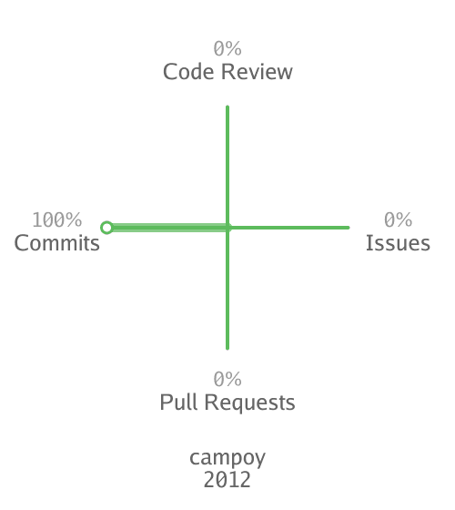
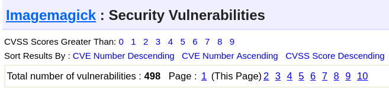
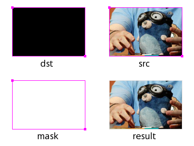
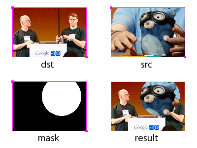
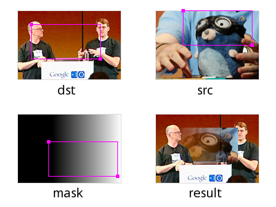

class: center, middle

# GIFs in Go
.cols[
  .left-col[
    .left[]
    .left[**GitHub**: @CamiloGarciaLaRotta]
  ]

  .righ-col[
    .center[]
    .right[thanks @egonelbre]
  ]
]

.left[
  .footnote[tinyurl.com/gifs-in-go]
]

???
Hi all, my name is Camilo and I've been tinkering in Go for about 2 years  

I consider myself a casual Gopher. Knowing just enough to get by.

I finished university last year, and am currently working at GitHub.

Today I want to share with you my thoughts on the strenghts and weaknesses of multiple gif libraries in Go

If you want to follow along, you can find the slides in the URL at the bottom

---

# Background

.left[
  .footnote[tinyurl.com/gifs-in-go]
]

???
GitHub has a graph which plots the distribution of your contributions by type

In general, the pattern I saw was the following:
- user begins by just commiting to their personal projects
- user starts using other people's code, so issues and PRs start to pop up
- finally the user maintains or collaborates on a project, leading to more code reviews

So I wrote a program called gifhub to allow me to see this progression for myself.

GifHub follows the pipeline design for concurrency:
- a stage for concurrently scraping the user profile for each year
- some intermediate stages to generate a graph
- and a sink stage to bundle all frames into a GIF

The initial dependencies where...  

--

### GifHub


.cols[
.left-col[
  .center[]
]

.right-col[
```bash
gifhub -d 40 campoy
```

#### Dependencies
- urfave/cli
- ImageMagick  
`SVG -> JPG -> GIF`
]
]

---
# Background

.left[
  .footnote[tinyurl.com/gifs-in-go]
]

### The Problem

???
Unfortunately, there were some issues with my initial choice of dependencies  

ImageMagic is not cross platform. Meaning that OSX and Windows users must rely on the containerized version of the CLI.  

But more importantly, ImageMagic has an absurd amount of open vulnerabilities.

So I decided to release a new version without ImageMagick

--

Windows and OSX users must use containerized version

--

But more importantly...

--



---

# Playground

All the code can be found in the `gif-playground` branch of the GifHub repo:
`tinyurl.com/gifhub`

.left[
  .footnote[tinyurl.com/gifs-in-go]
]

--
.left[### Libraries Explored]
.cols[
.left-column[
- [image/gif](https://golang.org/pkg/image/gif/) (standard lib)
- [llgcode/draw2d](https://github.com/llgcode/draw2d)
- [peterhellberg/gfx](https://github.com/peterhellberg/gfx)
- [fogleman/gg](https://github.com/fogleman/gg)
]
]

???
All the code I'll be showing in this presentation can be found in GifHub's playground branch

I am not related in anyway to these projects, I simply want to showcase their strenghts and weaknesses so that other developpers know what tool to use depending on their problem

A small warning: some of the GIFs contain flashes. If anyone in the audience suffers with epilepsy I am happy to remove those images.

---

# image/gif

.left[
  .footnote[tinyurl.com/gifs-in-go]
]

```go
// image/gif
type GIF struct {
  Image []*image.Paletted
  Delay []int // in 100ths of a second.
  ...
}
```

```go
//image
type Paletted struct {
  // Pix holds the image's pixels, as palette indices. 
  Pix []uint8
  // Rect is the image's bounds.
  Rect Rectangle
  // Palette is the image's palette.
  Palette color.Palette
  ...
}
```

???
So let's start with the basics. How does the stlib deal with GIFs?

At the very core a GIF is just a struct with N number of images and delays

Go has many ways of representing images. 

But the **ONLY** one you can use to construct GIFs is the palleted one. 

This is important to know from the get-go since manipulation methods tend to vary greatly between image formats

A palleted image is a rectangle, a set of for each pixel in that rectangle and the pallete which maps the index with a color

---

# image/gif

.left[
  .footnote[tinyurl.com/gifs-in-go]
]

```go
  // blog.golang.org/image-draw
  // randomFrame creates a frame of size w x h
1 func randomFrame(w, h int) *image.Paletted {

2   img := image.NewPaletted(
3     image.Rect(0, 0, w, h),  palette.Plan9)

4   draw.Draw(
5     img, 
6     img.Rect, 
7     &image.Uniform{randomColor()}, 
8     image.ZP, 
9     draw.Src)

10   return img
11 }
```

???
Go's rendering model is based on the classic "Compositing Digital Images" paper by Porter and Duff. I have posted a link to a great digest of the paper by the Go blog. 

But I'll walk you through a practical example

the Draw method takes a dst image, dst rectangle, a src image and src starting point. 

Finally it takes an operation to apply.

---

# image/gif

.left[
  .footnote[tinyurl.com/gifs-in-go]
]

.center[

]
---

# image/gif

.left[
  .footnote[tinyurl.com/gifs-in-go]
]
.center[

]
---

# image/gif

.left[
  .footnote[tinyurl.com/gifs-in-go]
]
.center[

]
---

# image/gif

.left[
  .footnote[tinyurl.com/gifs-in-go]
]

```go
1	numFrames := 5
2	var delays = make([]int, numFrames)
3	var frames = make([]*image.Paletted, numFrames)

4	for i := 0; i < numFrames; i++ {
5		delays[i] = 50
6		frames[i] = randomFrame(h, w)
7	}
```
--
```go
8   g := gif.GIF{Delay: delays, Image: frames}
10  f, err := os.Create("stdlib.gif")
 
11  gif.EncodeAll(f, &g)
```

---

# image/gif

.left[
  .footnote[tinyurl.com/gifs-in-go]
]

.cols[
.left-col[

]
.right-col[
#### Good
In-depth understanding of stdlib
#### Bad
Must create lots of higher abstraction helper methods
]
]

???
I highly encourage everyone who is thinking of doing image manipulation in Go to go through the standard data types before writing any code.

Playing with these primitives is quite fun

And familiarizing yourselves with how they are instantiated, manipulated and persisted is quite useful 

---

# llgcode/draw2d

???
Generates complex images through a helper struct.

This library follow the HTML canvas standard

So if you are familiar with the coordinate system top left corner, as well as the API to movethe cursor around the canvas, you are good to go

--

.left[
  .footnote[tinyurl.com/gifs-in-go]
]

```go
   // Initialize the graphic context on an RGBA image
1  dest := image.NewRGBA(image.Rect(0, 0, h, w))
2  gc := draw2dimg.NewGraphicContext(dest)
```
--
```go
   // Set some properties
3  gc.SetFillColor(randomColor())
4  gc.SetStrokeColor(randomColor())
5  gc.SetLineWidth(5)
```
--
```go
   // Draw a closed shape
6  gc.MoveTo(10, 10)
7  gc.LineTo(100, 50)
8  gc.QuadCurveTo(100, 10, 10, 10)
9  gc.Close()
10 gc.FillStroke()

   // then transform into image.Paletted
```
---

# llgcode/draw2d

.left[
  .footnote[tinyurl.com/gifs-in-go]
]

.cols[
.left-col[

]
.right-col[
#### Good 
Rich set of high level functions.  
Supports basic fonts.
#### Bad
No support for animations.   
No support for image.Paletted.  
]
]

???
Being able to feed stdlib images to the context is a very elegant of integrating with existent code, without the need to do major refactoring

Unfortunately, the lack of support for palleted images and animations means we can only really use this library to manually construct complex static images

then manually transform to a GIF. This is a non-negligable overhead

---

# peterhellberg/gfx

.left[
  .footnote[tinyurl.com/gifs-in-go]
]

???
A library with higher graphical functions such as domain coloring and noise algorithms

The main difference in usage with draw2d is that gfx does not take stdlib images

Instead you create images solely by interacting with the gfx API

Depending on your use case this might be a win or a loose

--

```go
1 a := &gfx.Animation{Delay: 15}
2 for i := 0; i < 10; i++ {
```
--
```go
3   m := gfx.NewPaletted(w, h)
```
--
```go
4   p := gfx.Polygon{
      //repeat the line below 4x
6     {rand.Float64()*w, rand.Float64()*h},
7   }
8   gfx.DrawPolygon(m, p)
```
--
```go
    // repeat the line below 4x
9   gfx.DrawCircleFilled(
10    m, gfx.V(rand.Float64()*w, rand.Float64()*h))
```
--
```go
11  a.AddPalettedImage(m)
12 }
```
--
```go
13 a.SaveGIF("gfx.gif")
```

---

# peterhellberg/gfx

.left[
  .footnote[tinyurl.com/gifs-in-go]
]

.cols[
.left-col[

]
.right-col[
#### Good
Support for animations.  
Richest library for manipulation:
- Noise
- Color palletes
- Geometric transformations

#### Bad
No support for fonts.  
Highly experimental library.
]
]

???
Unfortunately, the author is quite explicit about not guaranteeing any breaking changes

I highly recomend this library if you want quick, powerful image manipulation for a short-termed project

Unfortunately, for GifHub, the lack of support for fonts is a deal breaker

---

# fogleman/gg

.left[
  .footnote[tinyurl.com/gifs-in-go]
]

```go
1   const S = 1024
2   dc := gg.NewContext(S, S)
3   dc.SetRGBA(0, 0, 0, 0.1)
4   for i := 0; i < 360; i += 15 {
5     dc.Push()
6     dc.RotateAbout(gg.Radians(float64(i)), S/2, S/2)
7     dc.DrawEllipse(S/2, S/2, S*7/16, S/8)
8     dc.Fill()
9     dc.Pop()
10  }
11  dc.SavePNG("gg.png")
```

???
Finally we arrive at gg

It is a mixture of both draw2d's canvas style image manipulation

with gfx's approach of completely abstracting away the stdlib image types

---
# fogleman/gg

.left[
  .footnote[tinyurl.com/gifs-in-go]
]

.cols[
.left-col[

]
.right-col[
#### Good
Support for fonts.  
Active project and stable API. 
Rich set of high level functions.  
Among the most used img libs.

#### Bad
No support for animations.   
No support for image.Paletted.
]
]

???
While this library does not support animations either,


The fact that it is actively used, maintained and has a stable API

made it a good fit for my project.

---

# Outcome

.left[
  .footnote[tinyurl.com/gifs-in-go]
]

- Same `real` time because Go doesn't outperform C/C++ in image manipulation
- Less `user` time because all ops are inside the Go runtime  
- No need for garbage collection
- Now trully cross-platform

.cols[
.left-col[
```bash
$ git checkout v0.1
$ go build main.go
$ time ./main campoy
    real	0m6.403s
    user	0m22.083s ⚠️
    sys	 0m1.598s
```
]
.right-col[
```bash
$ git checkout v0.2
$ go build main.go
$ time ./main campoy
    real	0m6.127s
    user	0m3.432s ✅
    sys 	00m0.064s
```
]
]

???
The final pipeline is
- scrape yearly contributions concurrently
- generate individual png's of each year's graph with gg
- bundle all the png's via stdlib's GIF encoding

Real time means the wall clock time, or time as we humans perceive it

User time means the time the CPU spent on the given process


---

# Take Aways

.left[
  .footnote[tinyurl.com/gifs-in-go]
]

- Removing non-Go deps is not a question of fanatism  
  It can be a way to ensure cross-platform execution

- The stdlib is great, but for quick spikes user-libs are better

- Dont be afraid to look under the hood to understand how the stdlib works

.center[

]
