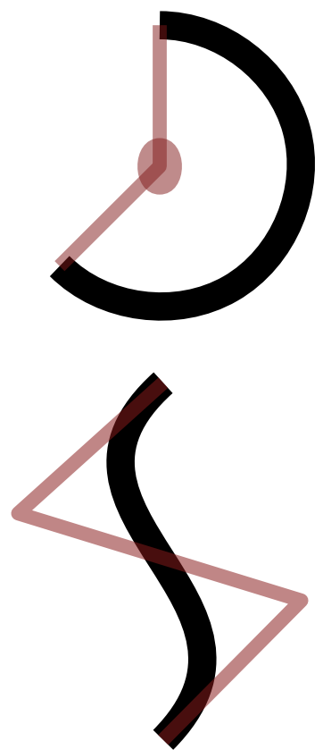

class: center, middle

# GIFs in Go
.cols[
.left-col[
.left[]
.left[**Go Discord**: @cegal]
.left[**GitHub**: @CamiloGarciaLaRotta]
]

.righ-col[
.right[]
.right[thanks @egonelbre]
]
]

???
just graduated in Software Engineering  
have been tinkering in Go for about 2 years

I am available on the go discord channel  
and you can find me on GitHub by my full name 

This talk is about the strenghts and weaknesses of multiple gif libraries in Go

---

# Background

???
I wrote a program a while back called gifhub  
A single example will clarify what it does

It follows the pipeline design for concurrency  
a stage for concurrently scraping the user profile for each year  
some stages to generate a graph
and a sink stage to bundle all frames into a GIF

--

### GifHub
.left[
.footnote[
tiny.cc/gifhub
]
]
--
.cols[
.left-col[
.center[]
]
.right-col[
```bash
gifhub -d 40 campoy
```
#### Dependencies
- urfave/cli
- ImageMagick  
  `SVG -> JPG -> GIF`
]
]

---
# Background

### The Problem

???
Thanks to the Discord chat who pointed this out to me  
I decided to release a new version without ImageMagick

--

Windows and OSX users must use containerized version

--

But more importantly...

--


---

# Playground

All the code can be found in the `gif-playground` branch

.left[
.footnote[
tiny.cc/gifhub
]
]
--
.left[### Libraries Explored]
.cols[
.left-column[
- image/gif (standard lib)
- llgcode/draw2d
- peterhellberg/gfx
- fogleman/gg
]
.right-column[
.no-bullet[
- `tiny.cc/stdlib`
- `tiny.cc/draw2d`
- `tiny.cc/gfx`
- `tiny.cc/gg`
]
]
]

???
EPILEPSY WARNING
---

# image/gif

```go
// image/gif
type GIF struct {
  Image []*image.Paletted
  Delay []int // in 100ths of a second.
  ...
}
```
--
```go
//image
type Paletted struct {
  // Pix holds the image's pixels, as palette indices. 
  Pix []uint8
  // Rect is the image's bounds.
  Rect Rectangle
  // Palette is the image's palette.
  Palette color.Palette
  ...
}
```

---

# image/gif

```go
  // randomFrame creates a frame of size w x h
1 func randomFrame(w, h int) *image.Paletted {

2   img := image.NewPaletted(
3     image.Rect(0, 0, w, h),  palette.Plan9)

4   draw.Draw(
5     img, 
6     img.Rect, 
7     &image.Uniform{randomColor()}, 
8     image.ZP, 
9     draw.Src)

10   return img
11 }
```

???
TODO point to src and all those filters article
https://blog.golang.org/go-imagedraw-package

---

# image/gif
.center[

]
---

# image/gif
.center[

]
---

# image/gif
.center[

]
---

# image/gif

```go
1	numFrames := 5
2	var delays = make([]int, numFrames)
3	var frames = make([]*image.Paletted, numFrames)
4	for i := 0; i < numFrames; i++ {
5		delays[i] = 50
6		frames[i] = randomFrame(h, w)
7	}
```
--
```go
8   g := gif.GIF{Delay: delays, Image: frames}
10  f, err := os.Create("stdlib.gif")
11  if err != nil {
12    log.Fatal(err)
13  }
14  defer f.Close()
 
15  if err := gif.EncodeAll(f, &g); err != nil {
16    log.Fatal(err)
27  }
```

---

# image/gif

.cols[
.left-col[

]
.right-col[
#### Good
In-depth understanding of stdlib
#### Bad
Must create lots of higher abstraction helper methods
]
]

---

# llgcode/draw2d

```go
   // Initialize the graphic context on an RGBA image
1  dest := image.NewRGBA(image.Rect(0, 0, h, w))
2  gc := draw2dimg.NewGraphicContext(dest)
```
--
```go
   // Set some properties
3  gc.SetFillColor(randomColor())
4  gc.SetStrokeColor(randomColor())
5  gc.SetLineWidth(5)
```
--
```go
   // Draw a closed shape
6  gc.MoveTo(10, 10)
7  gc.LineTo(100, 50)
8  gc.QuadCurveTo(100, 10, 10, 10)
9  gc.Close()
10 gc.FillStroke()

   // then transform into image.Paletted
```
---

# llgcode/draw2d

.cols[
.left-col[

]
.right-col[
#### Good 
Rich set of high level functions.  
Supports basic fonts.
#### Bad
No support for animations.   
No support for image.Paletted.  
]
]


---

# peterhellberg/gfx

```go
1 a := &gfx.Animation{Delay: 15}
2 for i := 0; i < 10; i++ {
```
--
```go
3   m := gfx.NewPaletted(w, h)
```
--
```go
4   p := gfx.Polygon{
      //repeat the line below 4x
6     {rand.Float64()*w, rand.Float64()*h},
7   }
8   gfx.DrawPolygon(m, p)
```
--
```go
    // repeat the line below 4x
9   gfx.DrawCircleFilled(
10    m, gfx.V(rand.Float64()*w, rand.Float64()*h))
```
--
```go
11  a.AddPalettedImage(m)
12 }
```
--
```go
13 a.SaveGIF("gfx.gif")
```

---

# peterhellberg/gfx

.cols[
.left-col[

]
.right-col[
#### Good
Support for animations.  
Richest library for manipulation:
- Noise
- Color palletes
- Geometric transformations

#### Bad
No support for fonts.  
Highly experimental library.
]
]

---

# fogleman/gg

```go
1   const S = 1024
2   dc := gg.NewContext(S, S)
3   dc.SetRGBA(0, 0, 0, 0.1)
4   for i := 0; i < 360; i += 15 {
5     dc.Push()
6     dc.RotateAbout(gg.Radians(float64(i)), S/2, S/2)
7     dc.DrawEllipse(S/2, S/2, S*7/16, S/8)
8     dc.Fill()
9     dc.Pop()
10  }
11  dc.SavePNG("gg.png")
```

---
# fogleman/gg
.cols[
.left-col[

]
.right-col[
#### Good
Support for fonts.  
Active project and stable API. 
Rich set of high level functions.  
Among the most used img libs.

#### Bad
No support for animations.   
No support for image.Paletted.
]
]

---

# Outcome

- Same `real` time because Go doesn't outperform C/C++ in image manipulation
- Less `user` time because all ops are inside the Go runtime  
- No need for garbage collection
- Now trully cross-platform

.cols[
.left-col[
```bash
$ git checkout v0.1
$ go build main.go
$ time ./main campoy
    real	0m6.403s
    user	0m22.083s
    sys	0m1.598s
```
]
.right-col[
```bash
$ git checkout v0.2
$ go build main.go
$ time ./main campoy
    real	0m6.127s
    user	0m3.432s
    sys   0m0.064s
```
]
]


---

# Take Aways
- Removing non-Go deps is not a question of fanatism  
  It can be a way to ensure cross-platform execution
- The stdlib is great, but for images user-libs are better
- Dont be afraid to look under the hood to understand how the stdlib works

.center[

]
